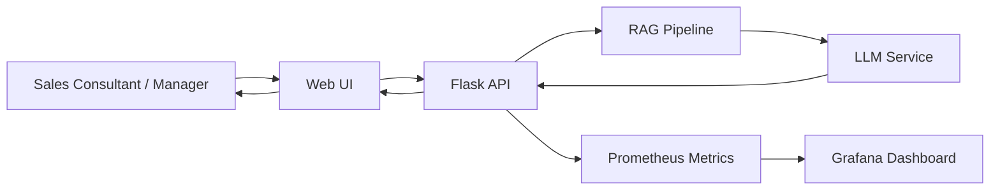
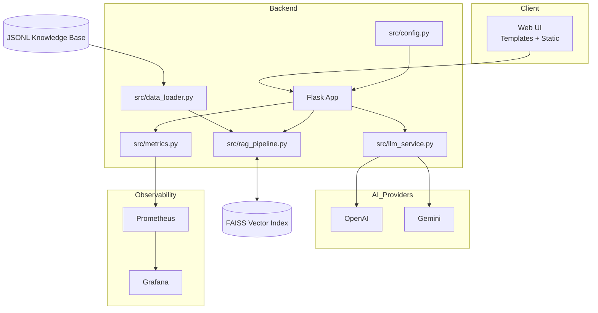
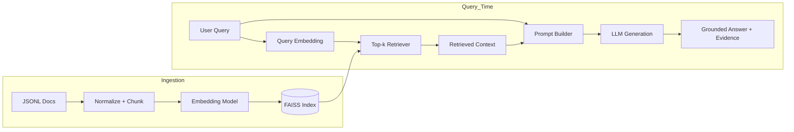

# Pitch Deck - Mitsubishi Sales Knowledge Studio
## Deck Link
- PowerPoint Deck: `https://365bsi-my.sharepoint.com/:p:/g/personal/bsi80269_bsi_co_id/IQCxWEJCtxDmS4JgVjA5TYVeATKRiCAH79EONGP8hGV35Wg?e=6h2w2M`

## Slide 1 - Hook: The Cost of Inconsistent Sales Conversations
- In dealerships, one weak customer conversation can mean a lost unit, delayed cashflow, and lower trust.
- Teams still rely on scattered SOP docs and individual memory during live conversations.
- We built a practical AI copilot to make every consultant perform like the best-trained one.

---

## Slide 2 - Problem Statement
- Sales consultants handle repeated high-stakes moments: follow-up, objection handling, delay complaints, escalation.
- Knowledge is fragmented across files, chats, and people.
- Impact:
  - inconsistent answers across branches,
  - slower onboarding,
  - avoidable SOP mistakes,
  - weak manager coaching evidence.

---

## Slide 3 - Unique Value Proposition
- **Mitsubishi-focused RAG assistant**, not a generic chatbot.
- **Grounded answers** from internal training/SOP datasets.
- **Built-in trainee scoring** on accuracy, completeness, SOP alignment, clarity, actionability.
- **Operational monitoring** for latency, token usage, retrieval behavior, and cost visibility.

---

## Slide 4 - Solution Overview (How It Works)
- Flask backend + lightweight web UI for fast operation and deployment.
- Retrieval pipeline: JSONL knowledge -> chunking -> embeddings -> FAISS -> top-k context.
- LLM routing:
  - hybrid mode (Gemini primary/fallback + OpenAI backup), or
  - OpenAI-only mode.
- Observability: Prometheus + Grafana Cloud via Alloy.

---

## Slide 5 - Demonstration Walkthrough
- **Knowledge Assistant**: ask SOP question -> grounded answer + retrieved context.
- **Trainee QnA Scoring**: generate/evaluate trainee answers with structured feedback.
- **Mock Test Mode**: timed 5-question simulation + aggregate evaluation report.
- **Developer Monitoring View**: request history, token usage, estimated LLM cost.

---

## Slide 6 - Why This Wins
- Faster consultant readiness and better consistency without replacing managers.
- Clear coaching signals from scored outputs, not subjective feedback only.
- Lower risk of SOP communication errors in delivery, escalation, and complaint handling.
- Practical for real operations: measurable, monitorable, and deployable.

---

## Slide 7 - What Could Be Improved
- Expand scenario coverage (financing edge cases, after-sales complaints, delivery delay recovery, competitor handling).
- Add calibration set with manager-reviewed gold answers.
- Add role-based rubrics and trainee progress analytics.
- Harden for broader production: auth, RBAC, rate limiting, stricter secret management.

---

## Slide 8 - Conclusion
- This project converts static SOP knowledge into an interactive, coachable operating system.
- It supports both frontline execution and manager development loops.
- The outcome: more consistent conversion behavior, faster onboarding, and measurable quality improvement.

---

## Slide 9 - Thank You
- Thank you.
- Ready for Q&A and live demonstration.

---

## Appendix A - Technical Deep Dive (After Thank You)

### A1) End-to-End Request Lifecycle
- UI sends request to Flask endpoint (`/api/ask` or scoring endpoint).
- Service normalizes input, embeds query, and retrieves top-k chunks from FAISS.
- Prompt builder injects retrieved SOP context + response policy.
- LLM router selects provider mode (hybrid or OpenAI-only), then applies timeout/retry/token caps.
- Response is parsed and returned with retrieved context; metrics are emitted to Prometheus.

### A2) Core Components and Ownership
- `src/config.py`: typed runtime configuration and environment validation.
- `src/data_loader.py`: JSONL loading, normalization, and preprocessing.
- `src/rag_pipeline.py`: chunking, embedding calls, vector index lifecycle, retrieval.
- `src/llm_service.py`: provider routing, fallback strategy, generation controls.
- `src/metrics.py`: latency, token, and retrieval instrumentation for Grafana visibility.

### A3) Reliability and Safety Controls
- Grounded-answer policy: model is instructed to refuse unsupported claims.
- Input and output safeguards: max token bounds, timeout, and retry limits.
- Operational safeguards: Docker healthcheck + restart policy for service continuity.
- Observability safeguards: p95 latency, error rate, and token usage trends tracked continuously.

### A4) Engineering Roadmap (Next Iterations)
- Add offline retrieval evaluation set (Precision@k + human relevance checks).
- Add role-based access control (manager vs trainee permissions).
- Add async scoring queue for heavy workloads to protect interactive latency.
- Add managed secret store and key rotation workflow for production rollout.

### A5) Mermaid Diagram - Flow of Usage

### A6) Mermaid Diagram - App Architecture

### A7) Mermaid Diagram - RAG Architecture

---

### A8) Decision Rationale Matrix (Why These Choices)
- Business focus (sales SOP + coaching): chosen because consistency and training quality are the fastest path to measurable branch impact.
- AI approach (RAG): chosen to keep answers grounded in internal documents and reduce hallucination risk.
- Framework choice (Flask + server-rendered UI): chosen for speed, lower complexity, and easier deployment in pilot stage.
- Retrieval stack (embeddings + FAISS): chosen for low-latency local search and simple operations at current data scale.
- LLM routing (hybrid/OpenAI-only): chosen for resilience and cost-performance flexibility.
- Deployment (Docker Compose): chosen for reproducibility and quick rollout across demo/pilot environments.
- Monitoring (Prometheus + Grafana): chosen to control latency, errors, token cost, and retrieval behavior with evidence.
- Security posture (.env, least privilege, planned RBAC): chosen to balance fast delivery today with a clear hardening path.

---

## Appendix B - Technical Calculation (After Thank You)

### B1) Throughput and Capacity (Example)
Assume normal load profile from test command:
- Concurrent users: 4
- Average user cycle: ~8 seconds/request (including think time + model latency)

Estimated request rate:
- Requests/sec ~= 4 / 8 = 0.5 RPS
- Requests/min ~= 30 RPM

If average latency rises to 12 seconds:
- Requests/sec ~= 4 / 12 = 0.33 RPS
- Requests/min ~= 20 RPM

### B2) Token Cost Estimation Formula
Per-request cost formula:
- Cost = (prompt_tokens / 1,000,000 * input_price_per_1m) + (completion_tokens / 1,000,000 * output_price_per_1m)

Example using:
- prompt_tokens = 2,000
- completion_tokens = 500
- input price = 0.15 USD / 1M
- output price = 0.60 USD / 1M

Calculation:
- Input cost = 2,000 / 1,000,000 * 0.15 = 0.0003 USD
- Output cost = 500 / 1,000,000 * 0.60 = 0.0003 USD
- Total/request = 0.0006 USD

At 30 RPM for 60 minutes:
- Requests/hour = 1,800
- Estimated hourly cost = 1,800 * 0.0006 = 1.08 USD/hour

### B3) Monitoring KPI Targets (Suggested)
- p95 latency: < 3.0s for assistant endpoint under normal load
- Error rate: < 1%
- Empty/blocked request ratio: monitored weekly
- Retrieval quality proxy: maintain top-k relevance review samples > 80% acceptable

---

## Appendix C - Business-Side Calculation (After Thank You)

### C1) Conversion Uplift Scenario (Illustrative)
Assume per month:
- Leads handled: 1,000
- Current conversion to SPK: 12%
- Units sold: 120

If assistant + coaching improves conversion by +1.5 points:
- New conversion = 13.5%
- New units sold = 135
- Incremental units = +15

If average gross profit per unit = IDR 8,000,000:
- Incremental gross profit/month = 15 * 8,000,000 = IDR 120,000,000

### C2) Onboarding Productivity Gain
Assume:
- New consultants per quarter: 12
- Current time-to-basic-productivity: 8 weeks
- Improved to: 6 weeks
- Gain: 2 weeks/consultant

Total productivity weeks gained/quarter:
- 12 * 2 = 24 consultant-weeks

### C3) SOP Error Reduction Impact
Assume:
- SOP-related escalations/month: 40
- Estimated avoidable portion: 25%
- Reduction = 10 escalations/month

If each escalation costs IDR 500,000 in recovery effort/discount/time:
- Monthly savings = 10 * 500,000 = IDR 5,000,000

### C4) ROI Framing (Simple)
Monthly benefit (illustrative):
- Conversion uplift impact: IDR 120,000,000
- SOP escalation savings: IDR 5,000,000
- Total gross benefit: IDR 125,000,000

If monthly tooling + ops cost (LLM + infra + maintenance) = IDR 20,000,000:
- Net value/month = IDR 105,000,000
- ROI multiple = 125,000,000 / 20,000,000 = 6.25x

> Notes:
> - These are pitch-ready estimation models. Replace assumptions with your branch historical numbers for final board-level figures.

